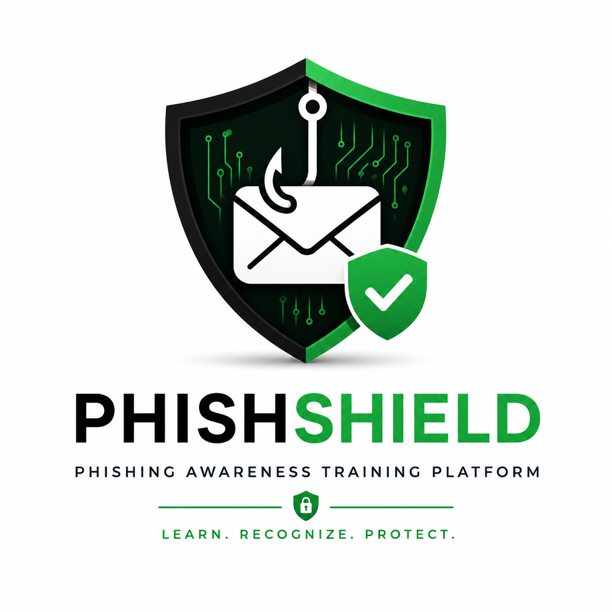
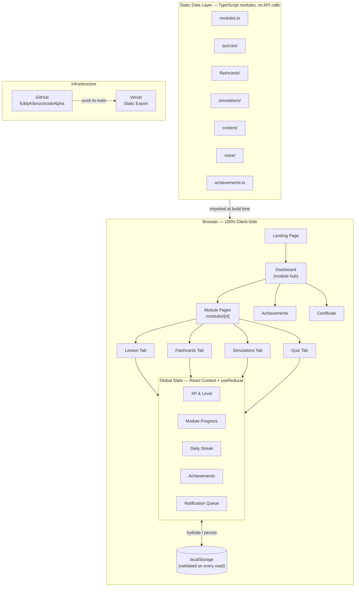
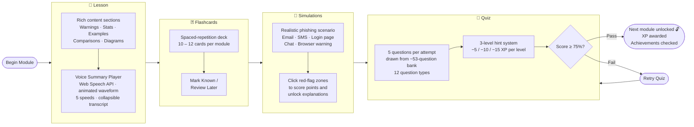
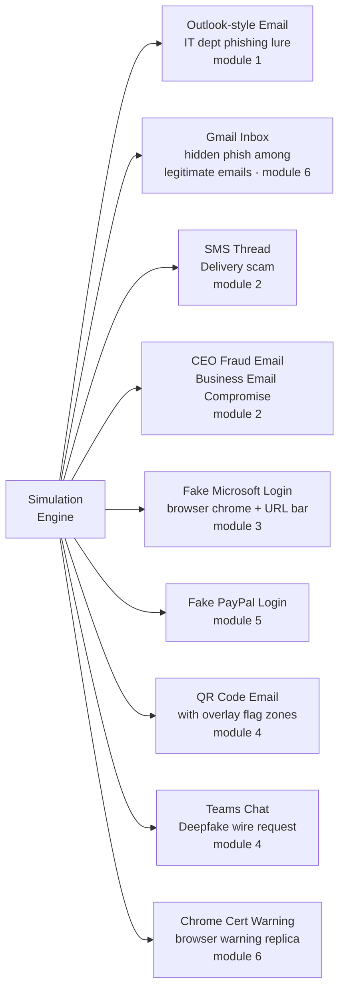
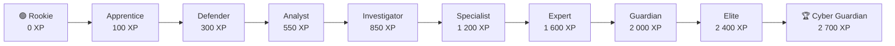
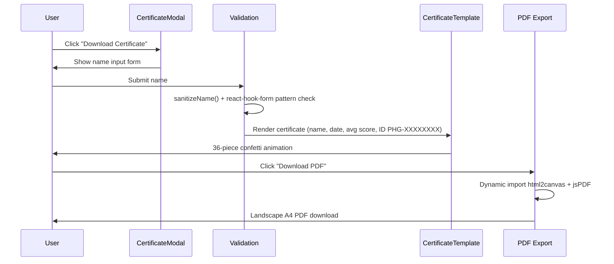

# PhishShield — Phishing Awareness Training Platform

<div align="center">



<br/>
<br/>

**A gamified, browser-based phishing awareness training platform.**

Structured lessons · Interactive simulations · Spaced-repetition flashcards · Gamified quizzes · Completion certificate

<br/>

[](https://phishingawarenesstraining-theta.vercel.app/)
[](https://github.com/EddyKilonzo/codeAlpha/issues)

<br/>


</div>

---

## What is PhishShield?

PhishShield teaches employees and individuals how to recognize, resist, and report phishing attacks. It covers everything from basic email red flags to advanced AI-generated lures — using realistic simulations, interactive exercises, and a gamified XP system to keep learners engaged from start to finish.

**No backend. No account. No tracking.** All progress lives in your browser's `localStorage`.

---

## Table of Contents

- [System Architecture](#system-architecture)
- [Learning Flow](#learning-flow)
- [Modules](#modules)
- [Simulations](#simulations)
- [Gamification System](#gamification-system)
- [Features](#features)
- [Tech Stack](#tech-stack)
- [Project Structure](#project-structure)
- [Deployment](#deployment)
- [Security](#security)

---

## System Architecture



---

## Learning Flow

Every module follows the same four-stage progression. Completing the quiz at ≥ 75% unlocks the next module.



---

## Modules

Six sequential modules covering the full phishing threat landscape — 71 minutes of structured content in total.

| # | Module | Time | XP | Highlights |
|---|--------|------|----|------------|
| 1 | **Introduction to Phishing** | 8 min | 150 XP | History, anatomy of a phishing URL, basic red flags |
| 2 | **Types of Phishing** | 12 min | 175 XP | Spear phishing, smishing, vishing, whaling, clone phishing |
| 3 | **How Attackers Operate** | 10 min | 200 XP | Reconnaissance, pretexting, social engineering lifecycle |
| 4 | **Advanced & Emerging Threats** | 11 min | 225 XP | QR phishing, deepfake audio, AI-generated lures, OAuth abuse |
| 5 | **Real-World Case Studies** | 20 min | 250 XP | 12 documented incidents: Colonial Pipeline, MGM Resorts, Twitter Bitcoin hack, Google/Facebook BEC ($100M+) |
| 6 | **Defense & Best Practices** | 15 min | 300 XP | MFA, password managers, reporting procedures, org-level controls |

**Course totals:** 1 300 XP from modules · ~66 flashcards · ~53 quiz questions · 9 simulations · 12 voice scripts

---

## Simulations

Nine realistic attack scenarios rendered as pixel-accurate UI replicas. Users click annotated "flag zones" to identify red flags — each zone reveals an explanation and awards points.



---

## Gamification System

### XP Sources & Penalties

| Action | XP |
|--------|----|
| Read a lesson section | +10 |
| Complete flashcard deck | +15 |
| Mark a flashcard "Known" | +2 |
| Complete voice summary | +5 |
| Pass a quiz | +50 |
| Perfect quiz score (100%) | +25 bonus |
| Complete a module | +100 |
| Daily streak (3 + days) | +20 / day |
| Use hint level 1 / 2 / 3 | −5 / −10 / −15 |

### 10-Level Progression



Completing the full course (1 300 module XP + up to ~690 XP from activity + 500 XP Cyber Guardian achievement) puts learners solidly in the **Elite → Cyber Guardian** range.

### 12 Achievements

| Category | Achievement | Bonus | Trigger |
|----------|------------|-------|---------|
| Progress | First Steps | +25 XP | Complete first module |
| Progress | Card Master | +30 XP | Finish a flashcard deck |
| Progress | Halfway There | +60 XP | Complete 3 modules |
| Progress | High Achiever | +80 XP | Complete 5 modules |
| Quiz | Quiz Champion | +50 XP | Pass 3 quizzes |
| Quiz | Perfect Score | +75 XP | Score 100% on any quiz |
| Mastery | No Hints Needed | +60 XP | Pass a quiz with zero hints |
| Mastery | Cyber Guardian | +500 XP | Complete the full course |
| Streak | Streak Starter | +40 XP | 3-day login streak |
| Streak | Streak Warrior | +100 XP | 7-day login streak |
| Exploration | Simulation Expert | +50 XP | Complete all simulations |
| Exploration | Speed Reader | +35 XP | Read a lesson in under 2 min |

Achievement unlocks fire a spring-animated toast (bottom-right) with a pulsing glow ring, animated XP count-up, and a 5-second auto-dismiss bar. Module completions trigger a `canvas-confetti` burst (120 particles).

### Completion Certificate

After passing all 6 modules the learner can download a personalised PDF certificate:



---

## Features

| Feature | Details |
|---------|---------|
| **Dark / Light Mode** | `next-themes` with full CSS token set; animated sun/moon toggle in header |
| **Voice Summary Player** | Web Speech API · 15-bar animated waveform · word-boundary progress · 5 speeds · Chrome pause workaround |
| **Skeleton Loading** | Layout-accurate skeletons on dashboard and module pages while `localStorage` hydrates |
| **Session Resumption** | Last open module and tab are saved; dashboard shows a "Continue" shortcut card |
| **Progressive Unlock** | Modules are locked until the previous one is passed; animated unlock flash on new module |
| **Reduced Motion** | `MotionConfig reducedMotion="user"` respects OS `prefers-reduced-motion` throughout |
| **12 Question Types** | Multiple choice, true/false, multi-select, URL recognition, match pairs, drag-and-drop, timeline ordering, hotspot, scenario, decision, email inspection, website inspection |
| **Case Study Timelines** | Interactive vertical timelines for 12 real incidents, colour-coded by event type (attack / discovery / response / impact / resolution) |
| **Animated XP Count-up** | All XP numbers animate from 0 to target via `requestAnimationFrame` on state change |

---

## Tech Stack

<div align="center">


</div>

<br/>

| Package | Version | Role |
|---------|---------|------|
| `next` | 15.x | Framework — App Router, static export (`output: 'export'`) |
| `react` / `react-dom` | 19 | UI |
| `typescript` | 5.x | Type safety |
| `tailwindcss` | 3.x | Utility-first styling |
| `framer-motion` | 12.x | All animations — page transitions, toasts, quiz feedback, parallax |
| `next-themes` | 0.4 | Dark / light mode |
| `@radix-ui/*` | various | Headless primitives: Dialog, Dropdown, Progress, Avatar, Tooltip, Sheet |
| `lucide-react` | 1.x | Icon set |
| `class-variance-authority` | 0.7 | Component variant API |
| `canvas-confetti` | 1.9 | Module-completion confetti burst |
| `html2canvas` + `jspdf` | latest | Certificate PDF export (dynamically imported) |
| `react-hook-form` | 7.x | Certificate name validation |
| Web Speech API | native | Voice summary player |

**No backend · No database · No authentication · Zero external API calls**

---

## Project Structure

```
Phishing Awareness Training Platform/
├── app/
│   ├── page.tsx                     # Landing page route
│   ├── layout.tsx                   # Root layout — fonts, Providers wrapper
│   ├── not-found.tsx                # Custom 404 with shield icon
│   ├── error.tsx                    # Global error boundary page
│   └── (dashboard)/
│       ├── layout.tsx               # Sidebar + Header + NotificationManager
│       ├── dashboard/               # Training hub — module list, XP, streak, cert trigger
│       ├── modules/[id]/            # Lesson · Flashcards · Simulations · Quiz tabs
│       ├── achievements/            # Achievement gallery grouped by category
│       └── certificate-preview/     # Dev-only certificate preview route
│
├── components/
│   ├── landing/                     # Hero, features section, module previews, footer CTA
│   ├── layout/                      # Sidebar, Header, XPBar, MobileNav, PageTransition
│   ├── lessons/                     # LessonSection + 8 card types (Warning, Stat, Expand…)
│   ├── flashcards/                  # FlashcardDeck, FlashCard (3D CSS flip)
│   ├── simulations/                 # SimulationRenderer + Email, SMS, Login, Chat, Browser sims
│   ├── quiz/                        # QuizEngine (12 question types), HintSystem, QuizResults
│   ├── certificate/                 # CertificateModal (confetti + PDF), CertificateTemplate
│   ├── gamification/                # NotificationManager, Achievement/LevelUp/ModuleComplete toasts
│   ├── voice/                       # VoiceSummaryPlayer — waveform, controls, transcript
│   ├── case-studies/                # CaseStudyCard, InteractiveTimeline, AttackFlowDiagram
│   ├── loading/                     # AppLoader, skeleton components
│   └── ui/                          # shadcn/ui primitives (Button, Badge, Dialog, Progress…)
│
├── context/
│   ├── ProgressContext.tsx          # Core state — useReducer, localStorage sync, notif diffing
│   └── Providers.tsx                # ThemeProvider + ProgressProvider + MotionConfig
│
├── data/
│   ├── modules.ts                   # 6 module definitions
│   ├── achievements.ts              # 12 achievement definitions
│   ├── quizzes/                     # ~53 questions across 6 quizzes
│   ├── flashcards/                  # ~66 flashcards across 6 decks
│   ├── simulations/                 # 9 simulation scenarios with flag zone coordinates
│   ├── content/                     # Rich structured lesson content for all 6 modules
│   └── voice/                       # Pre/post-quiz voice scripts (~200–300 words each)
│
├── hooks/
│   ├── useProgress.ts               # Consumer hook — stable action callbacks from context
│   ├── useSpeech.ts                 # Web Speech API wrapper with Chrome pause workaround
│   ├── useCountUp.ts                # rAF-based animated number counter
│   └── useLocalStorage.ts           # Generic typed localStorage hook
│
├── lib/
│   ├── constants.ts                 # XP_REWARDS, LEVELS array, MODULE_IDS, PASSING_SCORE
│   ├── levelUtils.ts                # getLevelFromXP, getLevelInfo, getProgressToNextLevel
│   ├── progressUtils.ts             # migrateProgress (full sanitization), calculateStreakDelta
│   ├── sanitize.ts                  # sanitizeName, sanitizeFilename
│   └── utils.ts                     # cn() — clsx + tailwind-merge
│
├── types/
│   └── index.ts                     # All interfaces: UserProgress, Question, Simulation, Achievement…
│
├── public/
│   └── logo.png                     # PhishShield shield logo / favicon
│
├── vercel.json                      # Framework preset + security headers (CSP, HSTS, X-Frame…)
└── next.config.ts                   # output: 'export'
```

---

## Deployment

Deployed to **Vercel** as a fully static export from the `Phishing Awareness Training Platform` subdirectory of the monorepo.

**Vercel project settings:**

| Setting | Value |
|---------|-------|
| Root Directory | `Phishing Awareness Training Platform` |
| Framework | Next.js (auto-detected) |
| Build Command | `npm run build` |
| Output | Static (`output: 'export'`) |

All security headers are applied at the CDN edge via `vercel.json` — no server required. Every push to `main` triggers an automatic redeploy.

---

## Security

- **Input sanitization** — `lib/sanitize.ts` strips dangerous characters from all user-supplied text before use; validated again at the `react-hook-form` layer
- **`localStorage` hardening** — `migrateProgress()` validates and schema-migrates every field on hydration: numeric ranges, ISO date regex, module ID allowlist, XP cap, certificate ID format (`/^PHG-[A-F0-9]{8}$/`)
- **PDF generation** — uses a Blob URL instead of `document.write`, eliminating any script-injection surface
- **Security headers** — full suite via `vercel.json`: Content-Security-Policy, HSTS (2-year), X-Frame-Options DENY, X-Content-Type-Options nosniff, Referrer-Policy, Permissions-Policy
- **Zero data egress** — no user data ever leaves the browser; no analytics, no tracking, no third-party scripts

---

<div align="center">

Built by [Eddy Kilonzo](https://github.com/EddyKilonzo)

</div>
