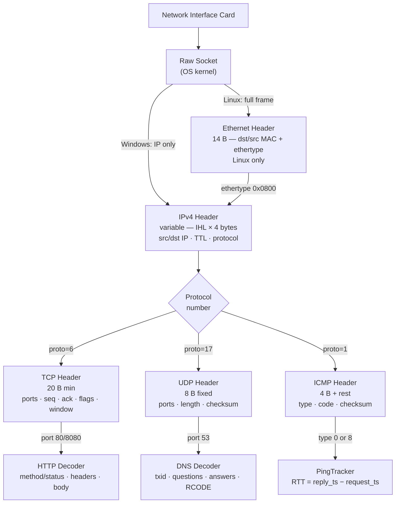
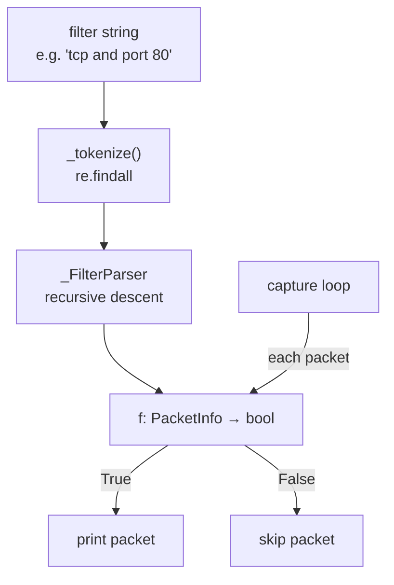
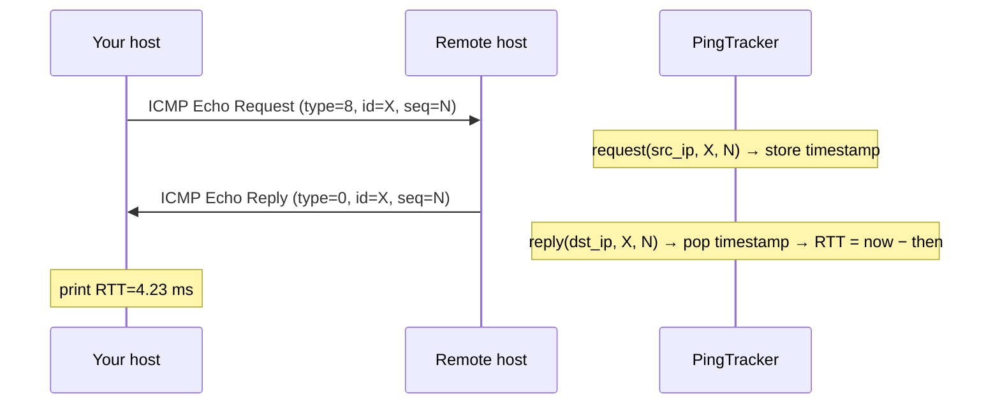

# Network Packet Sniffer

A Python packet sniffer with two runnable interfaces: a CLI tool with BPF-style filtering, HTTP/DNS/ICMP decoding and ICMP RTT measurement, and a live Rich terminal dashboard with interactive protocol filtering.

---

## Files

| File | Purpose |
|---|---|
| `network_sniffer.py` | CLI sniffer — filter engine, HTTP extraction, DNS decoding, ICMP RTT |
| `sniffer_dashboard.py` | Live terminal dashboard — real-time traffic display with interactive controls |
| `launch.bat` | Self-elevating launcher for the dashboard on Windows |
| `launch.ps1` | PowerShell launcher — opens the dashboard in a new elevated window |

---

## Prerequisites

```
Python 3.10+
colorama   — ANSI colour output for network_sniffer.py (required on Windows)
rich       — terminal UI for sniffer_dashboard.py
```

Install:
```bash
pip install colorama rich
```

Privileges:
- **Windows**: Run as Administrator (use `launch.bat` or `launch.ps1` for the dashboard)
- **Linux**: `sudo python3 …` or `sudo setcap cap_net_raw+ep $(which python3)`

---

## `network_sniffer.py` — CLI sniffer

### Usage

```powershell
# Capture everything
python network_sniffer.py

# DNS traffic only
python network_sniffer.py -f "udp and port 53"

# HTTP with verbose hex dumps, credentials redacted
python network_sniffer.py -f "tcp and port 80" -v --redact

# First 20 ICMP packets then stop
python network_sniffer.py -f "icmp" -c 20

# Local subnet
python network_sniffer.py -f "net 192.168.1.0/24" -v
```

### CLI flags

| Flag | Default | Description |
|---|---|---|
| `-f EXPR` / `--filter EXPR` | _(all traffic)_ | BPF-like filter expression |
| `-c N` / `--count N` | 0 (unlimited) | Stop after N matching packets |
| `-v` / `--verbose` | off | Hex-dump non-HTTP/DNS payloads |
| `--redact` | off | Replace `Authorization` and `Cookie` header values with `[REDACTED]` |

### Filter syntax

**Primitives**

| Expression | Matches |
|---|---|
| `tcp` / `udp` / `icmp` | Protocol |
| `[src\|dst] host <IP>` | Source or destination IP |
| `[src\|dst] port <N>` | Source or destination port |
| `[src\|dst] net <CIDR>` | IP within subnet |

**Connectives** (lowest → highest precedence): `or`, `and`, `not`, `( )`

**Examples**

```
tcp and port 80                   HTTP only
udp and port 53                   DNS queries/responses
icmp                              Ping traffic only
host 8.8.8.8                      Any traffic to/from 8.8.8.8
src host 192.168.1.5 and tcp      All TCP from a specific host
not port 443                      Exclude HTTPS
(tcp or udp) and dst port 53      DNS over TCP or UDP
net 192.168.0.0/16                Everything on the local /16
```

---

## `sniffer_dashboard.py` — live terminal dashboard

### Usage

```powershell
# Windows — double-click launch.bat, or from an elevated prompt:
python sniffer_dashboard.py

# Linux
sudo python3 sniffer_dashboard.py
```

### Keyboard shortcuts

| Key | Action |
|---|---|
| `Q` | Quit and show session summary |
| `P` | Pause / Resume the packet stream |
| `C` | Clear the packet log (counters kept) |
| `F` | Open / close the protocol filter dropdown |
| `↑` `↓` | Navigate dropdown |
| `Enter` | Confirm selected filter |
| `Esc` | Close dropdown without changing |
| `1` – `4` | Quick-select filter (All / TCP / UDP / ICMP) |

### Mouse

Click **"WHAT IS BEING SENT? [F] ▼"** to open the dropdown, then click any option row to select it.

---

## Architecture



### Platform differences

| | Linux | Windows |
|---|---|---|
| Socket type | `AF_PACKET, SOCK_RAW, 0x0003` | `AF_INET, SOCK_RAW, IPPROTO_IP` |
| Data starts at | Ethernet frame | IPv4 header |
| Extra setup | — | `SIO_RCVALL` (promiscuous mode) + `IP_HDRINCL` |
| Privilege | `sudo` or `cap_net_raw` | Run as Administrator |

### Filter engine (network_sniffer.py)

Filter expressions are tokenised then compiled by a recursive-descent parser into a composed Python predicate.



**Grammar** (lowest → highest precedence):

```
expr     = or_expr
or_expr  = and_expr  ( 'or'  and_expr )*
and_expr = not_expr  ( 'and' not_expr )*
not_expr = 'not' not_expr | primary
primary  = '(' expr ')'
         | ['src'|'dst'] 'tcp'|'udp'|'icmp'
         | ['src'|'dst'] 'host' <IP>
         | ['src'|'dst'] 'port' <N>
         | ['src'|'dst'] 'net'  <CIDR>
```

### DNS decoder

DNS pointer decompression follows RFC 1035 compression pointers (`0xC0xx`) and is guarded by `_DNS_JUMP_LIMIT = 20` hops plus per-pointer bounds checks to prevent any processing of malformed packets.

### ICMP RTT tracking



`time.monotonic()` is used so clock adjustments don't corrupt RTT measurements.

---

## Security considerations

- **Privileges required**: raw sockets require Administrator (Windows) or root / `cap_net_raw` (Linux). Do not leave the sniffer running unattended.
- **Credential capture**: HTTP traffic on port 80 is unencrypted. `network_sniffer.py` will display `Authorization` and `Cookie` headers in plaintext unless `--redact` is passed.
- **Authorised use only**: only monitor networks you own or have explicit written permission to test. Capturing traffic on networks you do not control may violate local laws.
- **Malformed packets**: all IP header parsers validate the IHL field and reject headers shorter than 20 bytes; DNS decompression is bounded against pointer loops and out-of-bounds reads.

---

## Tunable constants (`network_sniffer.py`)

```python
_DNS_JUMP_LIMIT  = 20   # max pointer hops before aborting DNS name decompression
_PREVIEW_TCP_B   = 64   # max TCP payload bytes shown per packet
_PREVIEW_UDP_B   = 48   # max UDP payload bytes shown per packet
_PREVIEW_ICMP_B  = 32   # max ICMP payload bytes shown per packet
_HTTP_BODY_CHARS = 120  # max HTTP body characters shown in verbose mode
```
